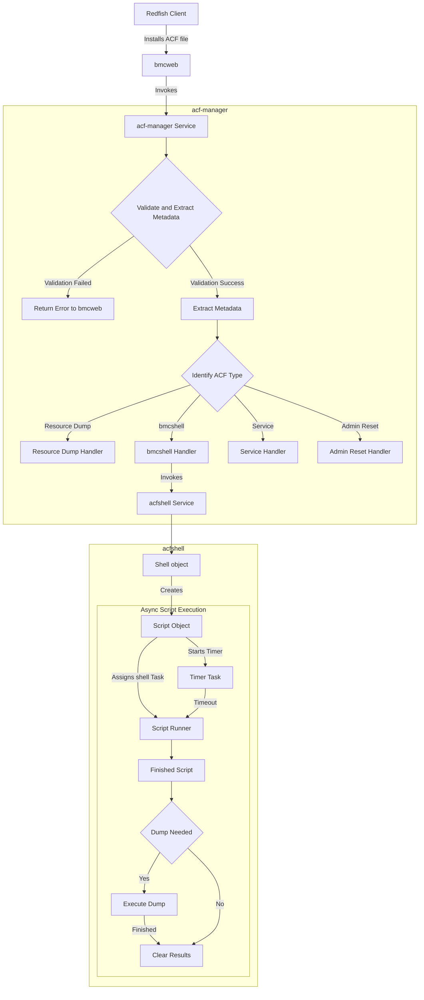

# Acf Shell

A shell environment for running shell scripts embedded in targeted ACF files.
This allows dynamic execution of scripts as part of the ACF workflow, enabling
custom script running using targeted acf.

## Design

