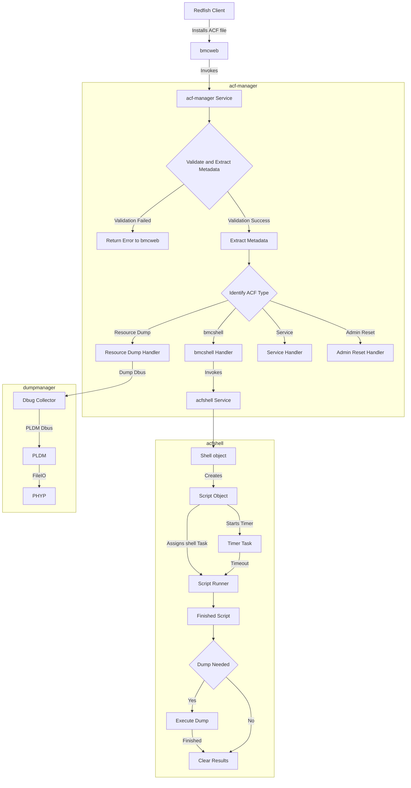

# Acf Shell

A shell environment for running shell scripts embedded in targeted ACF files.
This allows dynamic execution of scripts as part of the ACF workflow, enabling
custom script running using targeted acf.

## D-Bus Interfaces

The service provides objects implementing the `xyz.openbmc_project.TacfShell`
interface. To eliminate dependencies on the `phosphor-dbus-interfaces`
repository, no YAML interface files are used. The `TacfShell` interface supports
the following methods:

```sh
xyz.openbmc_project.TacfShell       interface -         -            -
.active                             method    -         as           -
.cancel                             method    s         b            -
.start                              method    stb       b            -
```

## Design


```mermaid
---
config:
  layout: dagre
---
flowchart TD
 subgraph s1["acf-manager"]
    direction TB
        D{"Validate and Extract Metadata"}
        C["acf-manager Service"]
        E["Return Error to bmcweb"]
        F["Extract Metadata"]
        G{"Identify ACF Type"}
        H["Resource Dump Handler"]
        I["bmcshell Handler"]
        J["Service Handler"]
        K["Admin Reset Handler"]
        L["acfshell Service"]
  end
 subgraph acfshell["acfshell"]
    direction TB
        M["Shell object"]
            N["Script Object"]
            O["Script Runner"]
            P["Timer Task"]
            Q["Finished Script"]
            R{"Dump Needed"}
            S["Clear Results"]
            T["Execute Dump"]
  end
subgraph dumpmanager["dumpmanager"]
    direction TB
      A1["Dbug Collector"]
            A2["PLDM"]
            A3["PHYP"]
        
end
    A["Redfish Client"] -- Installs ACF file --> B["bmcweb"]
    B -- Invokes --> C
    C --> D
    D -- Validation Failed --> E
    D -- Validation Success --> F
    F --> G
    G -- Resource Dump --> H
    H -- Dump Dbus --> A1
    A1 -- PLDM Dbus --> A2
    A2 -- FileIO--> A3
    G -- bmcshell --> I
    G -- Service --> J
    G -- Admin Reset --> K
    I -- Invokes --> L
    L --> M
    M -- Creates --> N
    N -- Assigns shell Task  --> O
    N -- Starts Timer  --> P
    P -- Timeout --> O
    O --> Q
    Q --> R
    R -- Yes --> T
    T -- Finished --> S
    R -- No --> S

```
